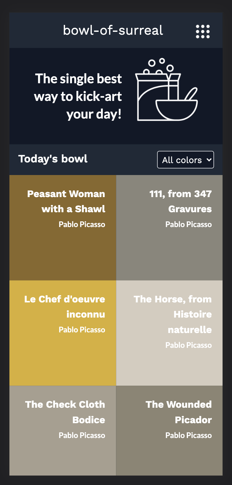
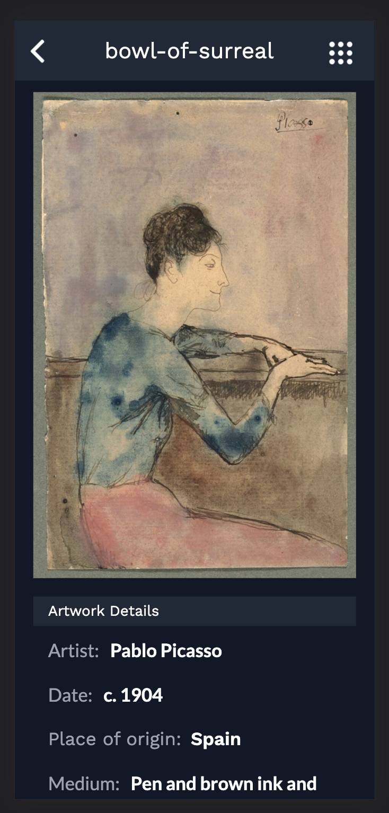

# bowl-of-surreal
Bowl-of-surreal is a fun little treat to enjoy while having a bowl of cereal in the morning. It was possible thanks to the [Art Institute of Chicago API](https://api.artic.edu/docs/), and will pour you a colorful bowl of artworks to explore. Each item got a [HSL color code](https://www.w3schools.com/colors/colors_hsl.asp) assigned by the intitute as part the piece&apos;s details, which was used to add color to the this UI. The design was inspired by [Nelson Sakwa's Ballhead App](https://www.behance.net/gallery/31579789/Ballhead-App-%28Free-PSDs%29).

Please enjoy!

## Screenshots

### Today's bowl

### Artwork details

## Built With

- Tailwind CSS 
- React-Redux
- Jest

## Live Demo

[Live Demo Link]()

## Getting Started

To get a local copy up and running follow the instructions.

### Setup

1. Open the terminal and clone the project using `git clone REPOURL` 

### Install

1. `cd` into the project folder and run `npm install`
2. Run the command `npm start`

## Tests

The test environment is set up with jest and jest-watcher run `npm test` to run tests.

## Author

👤 **Dante Alvarez**

- GitHub: [@danalvrz](https://github.com/danalvrz)
- Twitter: [@danalvrz](https://twitter.com/danalvrz)
- LinkedIn: [LinkedIn](https://www.linkedin.com/in/dante-álvarez-p)

## Acknowledgements

## 🤝 Contributing

Contributions, issues, and feature requests are welcome!

Feel free to check the [issues page](https://github.com/danalvrz/space-travelers-group-project/issues).

## Show your support

Give a ⭐️ if you like this project!

## 📝 License

This project is [MIT](./MIT.md) licensed.